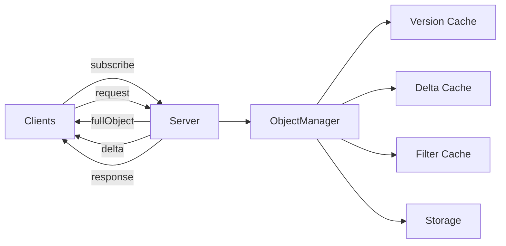

# Prism Documentation

Welcome to Prism! A versioned object synchronization protocol with implementations in Python, Scala, and TypeScript.

## What is Prism?

Prism is a protocol and library for **real-time synchronization of versioned objects** between clients and servers. It provides:

- **Delta updates** - Send only what changed (JSON Patch)
- **Smart caching** - Three-tier cache for performance
- **Filter system** - Security and data transformation
- **Reference hydration** - Automatic object resolution
- **Reconnection sync** - Never miss an update

## Quick Start

=== "Python"

    ```bash
    pip install prism
    ```

    ```python
    from prism import ObjectManager, PrismWebSocketHandler, MemoryStorage
    from fastapi import FastAPI, WebSocket

    storage = MemoryStorage()
    manager = ObjectManager(storage)
    handler = PrismWebSocketHandler(manager)

    app = FastAPI()

    @app.websocket("/ws")
    async def websocket_endpoint(websocket: WebSocket):
        await handler.handle_connection(websocket)
    ```

    [Full Python Guide →](getting-started/quickstart-python.md)

=== "TypeScript"

    ```bash
    npm install @prism/client
    ```

    ```typescript
    import { PrismClient } from '@prism/client'

    const client = new PrismClient('ws://localhost:8000/ws')
    await client.connect()

    await client.subscribe('user:123', (user) => {
      console.log('User updated:', user)
    })
    ```

    [Full TypeScript Guide →](getting-started/quickstart-typescript.md)

=== "Vue"

    ```bash
    npm install @prism/vue
    ```

    ```vue
    <script setup>
    import { usePrismObject } from '@prism/vue'

    const room = usePrismObject('room:123')
    </script>

    <template>
      <div v-if="room">
        <h1>{{ room.name }}</h1>
        <p>{{ room.description }}</p>
      </div>
    </template>
    ```

    [Full Vue Guide →](getting-started/quickstart-vue.md)

=== "Scala"

    ```scala
    libraryDependencies += "com.prism" %% "prism-core" % "0.1.0"
    ```

    [Full Scala Guide →](getting-started/quickstart-scala.md)

## Features

### Core Protocol

- ✅ **Versioned Objects** - Every object has an immutable version number
- ✅ **Delta Updates** - Efficient JSON Patch deltas sent over WebSocket
- ✅ **Reference Hydration** - Automatic resolution of object references
- ✅ **Filter System** - Security and data transformation at the protocol level
- ✅ **Reconnection Sync** - Automatic state reconciliation after disconnects

### Performance

- ✅ **Three-Tier Caching** - Version cache, delta cache, filter cache
- ✅ **Efficiency Checks** - Automatic fallback to full object when delta is larger
- ✅ **Smart Hydration** - Only fetch what's needed

### Implementations

| Feature | Python | TypeScript | Scala |
|---------|--------|------------|-------|
| Core Protocol | ✅ | ✅ | ✅ |
| Delta Computation | ✅ | ✅ | ✅ |
| Filter System | ✅ | ✅ | ✅ |
| Caching | ✅ | ✅ | ✅ |
| PostgreSQL Storage | ✅ | - | 📋 Planned |
| Memory Storage | ✅ | - | ✅ |
| FastAPI Integration | ✅ | - | - |
| http4s Integration | - | - | ✅ |
| Play Integration | - | - | ✅ |
| Vue Composables | - | ✅ | - |
| React Hooks | - | 📋 Planned | - |

## Architecture



[Read more about architecture →](protocol/architecture.md)

## Why Prism?

### For Application Developers

- **Easy to Use** - Simple API, works with your existing framework
- **Type Safe** - Full TypeScript/Scala types, Python type hints
- **Well Tested** - 260+ unit tests, integration tests, E2E tests
- **Production Ready** - Caching, error handling, reconnection

### For Protocol Implementers

- **Language Agnostic** - Clear protocol specification
- **Reference Implementations** - Python, TypeScript, Scala
- **Interoperability** - All implementations work together
- **Extensible** - Add new languages easily

## Examples

### Chat Demo

A full-stack real-time chat application demonstrating:

- User management
- Room creation
- Real-time messaging
- Multi-client sync

[See the Chat Demo →](examples/chat-demo.md)

### More Examples

- [Cookbook](examples/cookbook.md) - Common patterns and recipes

## Community

- **GitHub Repository** - [github.com/rorygraves/prism](https://github.com/rorygraves/prism)
- **Issue Tracker** - [Report bugs and request features](https://github.com/rorygraves/prism/issues)
- **Discussions** - [Ask questions and share ideas](https://github.com/rorygraves/prism/discussions)

## License

Prism is open source software released under the [MIT License](https://github.com/rorygraves/prism/blob/main/LICENSE).

## Next Steps

Ready to get started? Choose your language:

- [Python Quickstart](getting-started/quickstart-python.md)
- [TypeScript Quickstart](getting-started/quickstart-typescript.md)
- [Scala Quickstart](getting-started/quickstart-scala.md)
- [Vue Quickstart](getting-started/quickstart-vue.md)

Or dive deeper:

- [Core Concepts](guides/concepts.md)
- [Protocol Specification](protocol/specification.md)
- [API Reference](api/python/index.html)
